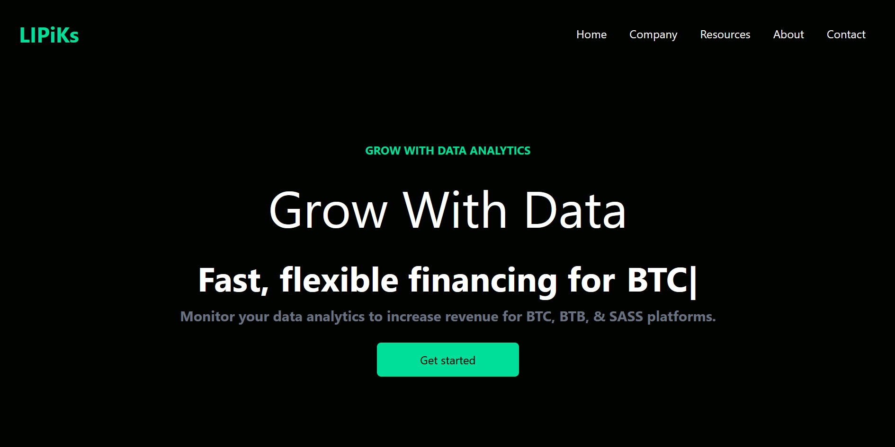

# LIPiKs - Data Finance Dashboard



LIPiKs is a modern React dashboard for data analytics and finance, built with Vite, React, Bun, and Tailwind CSS. Monitor your data analytics to increase revenue for BTC, BTB, & SAAS platforms.

## Features

- Responsive React UI with Tailwind CSS
- Animated hero section with typing effect
- Analytics dashboard and pricing cards
- Newsletter signup and footer with social links
- Optimized build with Vite

## Project Structure

```
├── public/
│   └── [images]
├── src/
│   ├── assets/
│   ├── components/
│   │   ├── Analytics.jsx
│   │   ├── Cards.jsx
│   │   ├── Footer.jsx
│   │   ├── Hero.jsx
│   │   ├── Navbar.jsx
│   │   └── Newsletter.jsx
│   ├── App.jsx
│   ├── index.css
│   └── main.jsx
├── index.html
├── package.json
├── vite.config.js
└── README.md
```

## Getting Started

### 1. Clone the repository

```sh
git clone https://github.com/specialbrocoli/LIPiKs.git
cd LIPiKs
```

### 2. Install dependencies

```sh
bun install
# or
npm install
```

### 3. Spawn dev server

```sh
bun run dev
# or
npm run dev
```

Visit [http://localhost:5173/](http://localhost:5173/) in your browser


## Build for Production
```sh
bun run build 
# or 
npm run install
```

## Tech Stack
- ⚡ [Bun](https://bun.sh)
- 🛠 [Vite](https://vitejs.dev/)
- ⚛ [React](https://react.dev/)
- 💡 [React Icons](https://react-icons.github.io/react-icons/)
- ⌨ [react-typed](https://www.npmjs.com/package/react-typed)
- 🎨 [Tailwind CSS](https://tailwindcss.com/)

Made with ❤️ by [specialbrocoli](https://www.github.com/specialbrocoli/)